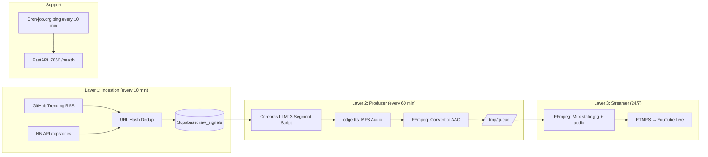
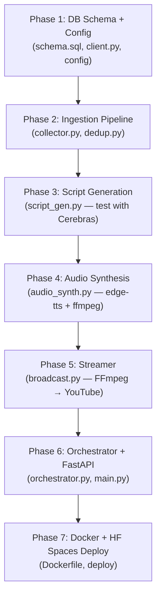

# 24/7 AI Radio Station — MVP Implementation Plan

## Goal

Build the **smallest end-to-end slice** of the autonomous AI radio station: a single YouTube Live stream that plays freshly generated ~15-min AI-narrated news segments about open-source and Hacker News topics, with new content every 60 minutes, running autonomously on Hugging Face Spaces.

> [!IMPORTANT]
> This is the **MVP scope**. Features like multi-provider LLM failover, TF-IDF clustering, Kokoro-82M fallback, additional show types, and background music ducking are **deferred to V2+**.

---

## Architecture Overview



---

## User Review Required

> [!CAUTION]
> **🚨 HOSTING BLOCKER: HF Spaces Docker SDK now requires PRO ($9/month)**
> Research confirmed that free Hugging Face accounts can **no longer create Docker SDK Spaces** — only Static Spaces and limited ZeroGPU Gradio spaces are available on free tier. This breaks the $0 constraint.
>
> **Alternatives to consider:**
> | Option | Cost | Pros | Cons |
> |--------|------|------|------|
> | **A) Accept $9/mo HF PRO** | $9/mo | Best DX, persistent sleep-disable, proven for this use case | Not $0 |
> | **B) Render.com Free Tier** | $0 | Docker support, 750 free hrs/mo, no card needed | Sleeps after 15 min idle, 512MB RAM |
> | **C) Fly.io Free Tier** | $0 (with card) | 3 shared VMs, persistent volumes, always-on | Requires credit card on file |
> | **D) Railway Starter** | $0 (trial) | Docker, easy deploy | $5 credit trial, then paid |
> | **E) Self-hosted (your PC)** | $0 | Full control, no limits | Requires your machine running 24/7 |
> | **F) Oracle Cloud Free Tier** | $0 | Always-free ARM VM (4 OCPU, 24GB RAM!) | Requires card, complex setup |
>
> **Recommendation:** Option **F (Oracle Cloud)** gives the most generous always-free compute. Option **A (HF PRO)** is simplest if $9/mo is acceptable. The code is Docker-based and works on any of these.

> [!WARNING]
> **YouTube API Key & Stream Key**: You'll need to manually create a YouTube Live stream and obtain a persistent stream key from [YouTube Studio → Go Live → Stream](https://studio.youtube.com). This cannot be automated without OAuth setup.

> [!IMPORTANT]
> **AI Content Disclosure**: YouTube requires AI-generated content to be labeled. The stream title/description must include a disclosure like "Content generated by AI".

> [!CAUTION]
> **🚨 LLM PROVIDER CHANGE: Cerebras free tier no longer exists**
> Research confirmed:
> - Cerebras now requires a **credit card** and offers only a **\$5 trial (30 days)** — not a perpetual free tier
> - **`llama-3.3-70b` is deprecated** (Feb 2026) — replaced by `gpt-oss-120b`
> - Free trial is limited to **~5 RPM** — too slow for our 6+ LLM calls per session
>
> **Recommended MVP LLM providers (truly free, no card):**
> | Provider | Model | Free Limits | Fits MVP? |
> |----------|-------|-------------|-----------|
> | **Groq** | `llama-3.1-8b-instant` | 500K TPD / org, 30 RPM | ✅ Best fit |
> | **Groq** | `llama-3.3-70b-versatile` | 100K TPD / org | ✅ Higher quality |
> | **Google AI Studio** | `gemini-2.5-flash` | 15 RPM, 1M TPD | ✅ Great fallback |
> | **OpenRouter** | Various `:free` routes | Varies | ⚠️ Last resort |
>
> **Plan update:** The code will use **Groq** as the primary LLM (OpenAI-compatible API, no card needed). Script generation code updated accordingly.

> [!IMPORTANT]
> **Supabase Project**: You'll need a free Supabase project. Sign up at [supabase.com](https://supabase.com) — no credit card required.

---

## Open Questions

> [!IMPORTANT]
> **Q1: DJ Persona** — Do you have a specific name/personality in mind for the AI DJ, or should I create one? (e.g., "Nova" — energetic tech-savvy host)

> [!IMPORTANT]
> **Q2: Stream Visual** — For MVP, I'll use a static branded image (1280x720). Do you have a logo/brand name, or should I generate one?

> [!NOTE]
> **Q3: Local development first?** — The plan assumes we build and test locally before deploying to HF Spaces. The code will work identically in both environments.

---

## Proposed Changes

### Project Directory Structure

```
AI-Powered 247 Radio/
├── Raw_Idea.md                    # (existing)
├── Dockerfile                     # HF Spaces Docker container
├── requirements.txt               # Python dependencies
├── .env.example                   # Template for secrets
├── app/
│   ├── __init__.py
│   ├── main.py                    # FastAPI entrypoint (port 7860)
│   ├── config.py                  # Settings & env vars
│   ├── ingestion/
│   │   ├── __init__.py
│   │   ├── collector.py           # GitHub Trending + HN API scrapers
│   │   └── dedup.py               # SHA-256 URL hash deduplication
│   ├── producer/
│   │   ├── __init__.py
│   │   ├── script_gen.py          # Cerebras LLM script generation
│   │   └── audio_synth.py         # edge-tts synthesis + AAC conversion
│   ├── streamer/
│   │   ├── __init__.py
│   │   └── broadcast.py           # FFmpeg RTMPS YouTube streamer
│   ├── db/
│   │   ├── __init__.py
│   │   ├── schema.sql             # Supabase table DDL
│   │   └── client.py              # Supabase Python client wrapper
│   └── scheduler/
│       ├── __init__.py
│       └── orchestrator.py        # APScheduler cron jobs
├── assets/
│   └── static_visual.jpg          # 1280x720 stream background
└── tests/
    ├── test_collector.py
    ├── test_dedup.py
    ├── test_script_gen.py
    └── test_audio_synth.py
```

---

### Component 1: Database Schema (Supabase)

#### [NEW] `app/db/schema.sql`

Minimal MVP schema — only 2 tables (no `story_clusters` yet):

```sql
-- Raw ingested signals with deduplication
CREATE TABLE raw_signals (
    id UUID PRIMARY KEY DEFAULT gen_random_uuid(),
    url_hash TEXT UNIQUE NOT NULL,        -- SHA-256 of canonical URL
    source_url TEXT NOT NULL,
    source_name TEXT NOT NULL,             -- 'github_trending' | 'hackernews'
    title TEXT NOT NULL,
    summary_text TEXT,
    ingested_at TIMESTAMPTZ DEFAULT NOW(),
    is_used BOOLEAN DEFAULT FALSE         -- marked TRUE once included in a script
);

CREATE INDEX idx_raw_signals_url_hash ON raw_signals(url_hash);
CREATE INDEX idx_raw_signals_unused ON raw_signals(is_used) WHERE is_used = FALSE;

-- Broadcast audit log (compliance + debugging)
CREATE TABLE broadcast_audit_log (
    session_id UUID PRIMARY KEY DEFAULT gen_random_uuid(),
    scheduled_start_at TIMESTAMPTZ NOT NULL,
    actual_aired_at TIMESTAMPTZ,
    full_script_transcript TEXT NOT NULL,
    cited_source_urls JSONB NOT NULL,      -- ["https://...", ...]
    llm_model TEXT NOT NULL,
    tts_engine TEXT DEFAULT 'edge-tts',
    audio_duration_seconds FLOAT,
    created_at TIMESTAMPTZ DEFAULT NOW()
);
```

#### [NEW] `app/db/client.py`

```python
"""Thin Supabase client wrapper."""
import os
import hashlib
from supabase import create_client, Client

def get_client() -> Client:
    return create_client(
        os.environ["SUPABASE_URL"],
        os.environ["SUPABASE_ANON_KEY"]
    )

def signal_exists(url: str) -> bool:
    """Check if a URL hash already exists."""
    url_hash = hashlib.sha256(url.encode()).hexdigest()
    client = get_client()
    result = client.table("raw_signals").select("id").eq("url_hash", url_hash).execute()
    return len(result.data) > 0

def insert_signal(source_url: str, source_name: str, title: str, summary: str = None):
    """Insert a new signal if not duplicate."""
    url_hash = hashlib.sha256(source_url.encode()).hexdigest()
    client = get_client()
    client.table("raw_signals").upsert({
        "url_hash": url_hash,
        "source_url": source_url,
        "source_name": source_name,
        "title": title,
        "summary_text": summary,
    }, on_conflict="url_hash").execute()

def get_unused_signals(limit: int = 15) -> list[dict]:
    """Fetch the newest unused signals for script generation."""
    client = get_client()
    result = (client.table("raw_signals")
              .select("*")
              .eq("is_used", False)
              .order("ingested_at", desc=True)
              .limit(limit)
              .execute())
    return result.data

def mark_signals_used(signal_ids: list[str]):
    """Mark signals as used after script generation."""
    client = get_client()
    client.table("raw_signals").update({"is_used": True}).in_("id", signal_ids).execute()

def log_broadcast(session_data: dict):
    """Insert a broadcast audit log entry."""
    client = get_client()
    client.table("broadcast_audit_log").insert(session_data).execute()
```

---

### Component 2: Signal Ingestion

#### [NEW] `app/ingestion/collector.py`

Two data sources for MVP:

```python
"""Collectors for GitHub Trending and Hacker News."""
import feedparser
import httpx
import logging

logger = logging.getLogger(__name__)

async def fetch_github_trending() -> list[dict]:
    """Fetch GitHub trending repos via RSS feed.
    
    Uses the unofficial GitHub trending RSS at:
    https://mshibanami.github.io/GitHubTrendingRSS/
    """
    feeds = [
        "https://mshibanami.github.io/GitHubTrendingRSS/daily/all.xml",
    ]
    signals = []
    for feed_url in feeds:
        try:
            async with httpx.AsyncClient(timeout=15) as client:
                resp = await client.get(feed_url)
                feed = feedparser.parse(resp.text)
                for entry in feed.entries[:20]:  # Top 20
                    signals.append({
                        "source_url": entry.link,
                        "source_name": "github_trending",
                        "title": entry.title,
                        "summary": getattr(entry, "summary", "")[:500],
                    })
        except Exception as e:
            logger.error(f"GitHub trending fetch failed: {e}")
    return signals

async def fetch_hackernews_top() -> list[dict]:
    """Fetch top stories from Hacker News API."""
    signals = []
    try:
        async with httpx.AsyncClient(timeout=15) as client:
            resp = await client.get("https://hacker-news.firebaseio.com/v0/topstories.json")
            story_ids = resp.json()[:20]  # Top 20
            
            for sid in story_ids:
                detail = await client.get(
                    f"https://hacker-news.firebaseio.com/v0/item/{sid}.json"
                )
                story = detail.json()
                if story and story.get("url"):
                    signals.append({
                        "source_url": story["url"],
                        "source_name": "hackernews",
                        "title": story.get("title", ""),
                        "summary": f"HN Score: {story.get('score', 0)}, "
                                   f"Comments: {story.get('descendants', 0)}",
                    })
    except Exception as e:
        logger.error(f"HN fetch failed: {e}")
    return signals
```

#### [NEW] `app/ingestion/dedup.py`

```python
"""Stage 1 deduplication: SHA-256 URL hash check against Supabase."""
from app.db.client import signal_exists, insert_signal
import logging

logger = logging.getLogger(__name__)

async def ingest_signals(signals: list[dict]) -> int:
    """Deduplicate and store new signals. Returns count of new signals."""
    new_count = 0
    for sig in signals:
        if not signal_exists(sig["source_url"]):
            insert_signal(
                source_url=sig["source_url"],
                source_name=sig["source_name"],
                title=sig["title"],
                summary=sig.get("summary"),
            )
            new_count += 1
    logger.info(f"Ingested {new_count} new signals out of {len(signals)} total")
    return new_count
```

---

### Component 3: Script Generation (Cerebras LLM)

#### [NEW] `app/producer/script_gen.py`

MVP uses 3 segments instead of 6 (~2,000 words total, ~15 min show):

```python
"""Generate radio show scripts using Cerebras API (OpenAI-compatible)."""
import os
from openai import OpenAI
import logging

logger = logging.getLogger(__name__)

# Groq uses OpenAI-compatible API — free, no credit card needed
client = OpenAI(
    base_url="https://api.groq.com/openai/v1",
    api_key=os.environ.get("GROQ_API_KEY", ""),
)

MODEL = "llama-3.3-70b-versatile"  # Higher quality; fallback: "llama-3.1-8b-instant"

DJ_PERSONA = """You are "Nova", the host of Open Source Pulse — a high-energy, 
insightful AI radio DJ who breaks down the latest in open source, developer tools, 
and Hacker News buzz. Your style is conversational, witty, occasionally sarcastic, 
and always technically accurate. You speak directly to your audience of developers 
and tech enthusiasts. Never say you're an AI — you're just Nova, the host."""

SEGMENT_PROMPTS = [
    # Segment 1: Opening + Lead Stories (~700 words, ~5 min)
    {
        "name": "opening",
        "instruction": """Write the OPENING segment of today's Open Source Pulse show (~700 words).

Include:
- A punchy cold open greeting (2-3 sentences max)
- Deep dive into the TOP 2-3 most interesting stories from the signals below
- Technical context: why these matter to developers
- Natural speech patterns: contractions, rhetorical questions, brief pauses noted as "..."

Signals to cover:
{signals}

Write ONLY the spoken script. No stage directions, no timestamps, no [MUSIC] cues.""",
    },
    # Segment 2: Community Buzz + Under-the-Radar (~650 words, ~5 min)
    {
        "name": "community_buzz",
        "instruction": """Write the MIDDLE segment of today's Open Source Pulse (~650 words).

Previous segment summary for smooth transition:
{prev_summary}

Include:
- Transition from previous segment
- 2-3 interesting but less-covered stories from the signals
- Developer community reactions and hot takes
- One "under the radar" pick that deserves more attention

Remaining signals:
{signals}

Write ONLY the spoken script. Natural, conversational tone.""",
    },
    # Segment 3: Rapid Recap + Signoff (~650 words, ~5 min)
    {
        "name": "recap_signoff",
        "instruction": """Write the CLOSING segment of today's Open Source Pulse (~650 words).

Previous segments summary:
{prev_summary}

Include:
- Quick-fire recap of everything covered today (bullet-style but spoken naturally)
- One bold prediction or hot take about where things are heading
- Warm signoff encouraging listeners to check out the repos/links
- Teaser for the next show: "Coming up in the next hour..."

Write ONLY the spoken script. End with energy.""",
    },
]


def generate_show_script(signals: list[dict]) -> tuple[str, list[str]]:
    """Generate a full 3-segment show script from signals.
    
    Returns: (full_script, cited_urls)
    """
    # Format signals as a digestible list for the LLM
    formatted_signals = "\n".join(
        f"- [{s['source_name']}] {s['title']} — {s.get('summary_text', 'No summary')}\n  URL: {s['source_url']}"
        for s in signals
    )
    
    full_script = ""
    prev_summary = ""
    cited_urls = [s["source_url"] for s in signals]
    
    for i, segment in enumerate(SEGMENT_PROMPTS):
        prompt = segment["instruction"].format(
            signals=formatted_signals,
            prev_summary=prev_summary or "This is the first segment.",
        )
        
        try:
            response = client.chat.completions.create(
                model=MODEL,
                messages=[
                    {"role": "system", "content": DJ_PERSONA},
                    {"role": "user", "content": prompt},
                ],
                temperature=0.8,
                max_tokens=1500,
            )
            segment_text = response.choices[0].message.content
            full_script += f"\n\n{segment_text}"
            
            # Generate brief summary for next segment's context
            summary_resp = client.chat.completions.create(
                model=MODEL,
                messages=[
                    {"role": "user", "content": f"Summarize this radio segment in 2-3 sentences:\n{segment_text}"},
                ],
                temperature=0.3,
                max_tokens=200,
            )
            prev_summary += f"\nSegment {i+1}: {summary_resp.choices[0].message.content}"
            
        except Exception as e:
            logger.error(f"Script generation failed for segment {i}: {e}")
            segment_text = f"[Technical difficulties — we'll be right back with more Open Source Pulse!]"
            full_script += f"\n\n{segment_text}"
    
    return full_script.strip(), cited_urls
```

---

### Component 4: Audio Synthesis (edge-tts)

#### [NEW] `app/producer/audio_synth.py`

```python
"""Synthesize speech from script using edge-tts, then convert to AAC."""
import edge_tts
import subprocess
import os
import uuid
import logging

logger = logging.getLogger(__name__)

VOICE = "en-US-AndrewMultilingualNeural"
QUEUE_DIR = "/tmp/radio_queue"  # Works on both local and HF Spaces

os.makedirs(QUEUE_DIR, exist_ok=True)

# edge-tts WebSocket drops on texts >10K chars.
# We chunk by paragraph and concatenate.
MAX_CHUNK_CHARS = 8000


def _chunk_text(text: str) -> list[str]:
    """Split text into chunks under MAX_CHUNK_CHARS, breaking at paragraphs."""
    paragraphs = text.split("\n\n")
    chunks, current = [], ""
    for para in paragraphs:
        if len(current) + len(para) + 2 > MAX_CHUNK_CHARS and current:
            chunks.append(current.strip())
            current = para
        else:
            current += "\n\n" + para if current else para
    if current.strip():
        chunks.append(current.strip())
    return chunks or [text]


async def synthesize_audio(script: str) -> tuple[str, float]:
    """Convert script text to AAC audio file.
    
    Chunks text to avoid edge-tts WebSocket timeouts on long texts.
    Returns: (aac_file_path, duration_seconds)
    """
    session_id = str(uuid.uuid4())[:8]
    aac_path = os.path.join(QUEUE_DIR, f"session_{session_id}.aac")
    
    # Step 1: Chunk text and synthesize each chunk to MP3
    chunks = _chunk_text(script)
    chunk_paths = []
    
    for i, chunk in enumerate(chunks):
        chunk_path = os.path.join(QUEUE_DIR, f"chunk_{session_id}_{i}.mp3")
        communicate = edge_tts.Communicate(chunk, VOICE, rate="+5%")
        await communicate.save(chunk_path)
        chunk_paths.append(chunk_path)
        logger.info(f"edge-tts chunk {i+1}/{len(chunks)} saved ({len(chunk)} chars)")
    
    # Step 2: Concatenate chunks → single MP3 (if multiple)
    if len(chunk_paths) == 1:
        combined_mp3 = chunk_paths[0]
    else:
        concat_list = os.path.join(QUEUE_DIR, f"concat_{session_id}.txt")
        with open(concat_list, "w") as f:
            for p in chunk_paths:
                f.write(f"file '{p}'\n")
        combined_mp3 = os.path.join(QUEUE_DIR, f"combined_{session_id}.mp3")
        subprocess.run([
            "ffmpeg", "-y", "-f", "concat", "-safe", "0",
            "-i", concat_list, "-c", "copy", combined_mp3
        ], check=True, capture_output=True)
        os.remove(concat_list)
    
    # Step 3: Convert MP3 → AAC (128kbps, 44.1kHz, stereo)
    subprocess.run([
        "ffmpeg", "-y",
        "-i", combined_mp3,
        "-c:a", "aac",
        "-b:a", "128k",
        "-ar", "44100",
        "-ac", "2",
        aac_path
    ], check=True, capture_output=True)
    
    # Get duration
    result = subprocess.run([
        "ffprobe", "-v", "quiet",
        "-show_entries", "format=duration",
        "-of", "csv=p=0",
        aac_path
    ], capture_output=True, text=True)
    duration = float(result.stdout.strip()) if result.stdout.strip() else 0.0
    
    # Cleanup temp files
    for p in chunk_paths:
        if os.path.exists(p):
            os.remove(p)
    if len(chunk_paths) > 1 and os.path.exists(combined_mp3):
        os.remove(combined_mp3)
    
    logger.info(f"AAC ready: {aac_path} ({duration:.1f}s)")
    return aac_path, duration
```

---

### Component 5: YouTube Streamer (FFmpeg)

#### [NEW] `app/streamer/broadcast.py`

```python
"""FFmpeg-based RTMPS streamer to YouTube Live."""
import subprocess
import os
import logging
import signal
import time

logger = logging.getLogger(__name__)

RTMPS_URL = "rtmps://a.rtmp.youtube.com:443/live2"
VISUAL_ASSET = os.path.join(os.path.dirname(__file__), "../../assets/static_visual.jpg")


class YouTubeStreamer:
    """Manages the FFmpeg process that streams to YouTube Live."""
    
    def __init__(self):
        self.process = None
        self.stream_key = os.environ.get("YOUTUBE_STREAM_KEY", "")
        
    def _build_ffmpeg_cmd(self, audio_path: str) -> list[str]:
        """Build FFmpeg command for streaming.
        
        Strategy: Loop a static image + play the audio file.
        YouTube requires: H.264, keyframe every 2s, AAC audio.
        """
        return [
            "ffmpeg", "-y",
            # Re-read at real-time speed
            "-re",
            # Input 1: Static image (looped)
            "-loop", "1",
            "-i", VISUAL_ASSET,
            # Input 2: Audio file
            "-i", audio_path,
            # Video: H.264, ultrafast preset, low bitrate
            "-c:v", "libx264",
            "-preset", "ultrafast",
            "-tune", "stillimage",
            "-b:v", "500k",
            "-maxrate", "500k",
            "-bufsize", "1000k",
            "-pix_fmt", "yuv420p",
            "-g", "60",            # Keyframe every 2s at 30fps
            "-keyint_min", "60",   # YouTube requires consistent GOP
            "-sc_threshold", "0",  # Disable scene-change keyframes
            "-r", "30",
            # Audio: re-encode to ensure AAC-LC compatibility
            "-c:a", "aac",
            "-b:a", "128k",
            "-ar", "44100",
            "-ac", "2",
            # Output
            "-f", "flv",
            "-flvflags", "no_duration_filesize",
            "-shortest",  # Stop when audio ends
            # Reconnect on transient network drops
            "-reconnect", "1",
            "-reconnect_at_eof", "1",
            "-reconnect_streamed", "1",
            "-reconnect_delay_max", "5",
            f"{RTMPS_URL}/{self.stream_key}"
        ]
    
    def stream_session(self, audio_path: str) -> bool:
        """Stream a single audio session to YouTube. Blocks until done."""
        if not self.stream_key:
            logger.error("YOUTUBE_STREAM_KEY not set!")
            return False
        
        cmd = self._build_ffmpeg_cmd(audio_path)
        logger.info(f"Starting stream: {audio_path}")
        
        try:
            self.process = subprocess.Popen(
                cmd,
                stdout=subprocess.PIPE,
                stderr=subprocess.PIPE,
            )
            _, stderr = self.process.communicate()
            
            if self.process.returncode != 0:
                logger.error(f"FFmpeg error: {stderr.decode()[-500:]}")
                return False
            
            logger.info("Stream session completed successfully")
            return True
            
        except Exception as e:
            logger.error(f"Stream failed: {e}")
            return False
    
    def stop(self):
        """Gracefully stop the FFmpeg process."""
        if self.process:
            self.process.send_signal(signal.SIGTERM)
            self.process.wait(timeout=10)
```

> [!NOTE]
> **MVP simplification**: For MVP, we re-encode the static image with `libx264 ultrafast` — this uses slightly more CPU than the zero-transcode approach in the full spec, but avoids the complexity of pre-rendering a looping .mp4 video. On 2 vCPUs with a still image, this is ~5-10% CPU usage.

---

### Component 6: Orchestrator (Scheduler)

#### [NEW] `app/scheduler/orchestrator.py`

```python
"""Main orchestrator: ties ingestion, production, and streaming together."""
import asyncio
import logging
from datetime import datetime, timezone
from apscheduler.schedulers.asyncio import AsyncIOScheduler

from app.ingestion.collector import fetch_github_trending, fetch_hackernews_top
from app.ingestion.dedup import ingest_signals
from app.producer.script_gen import generate_show_script
from app.producer.audio_synth import synthesize_audio
from app.streamer.broadcast import YouTubeStreamer
from app.db.client import get_unused_signals, mark_signals_used, log_broadcast

logger = logging.getLogger(__name__)
streamer = YouTubeStreamer()


async def run_ingestion():
    """Collect and deduplicate signals from all sources."""
    logger.info("=== Running signal ingestion ===")
    gh_signals = await fetch_github_trending()
    hn_signals = await fetch_hackernews_top()
    all_signals = gh_signals + hn_signals
    new_count = await ingest_signals(all_signals)
    logger.info(f"Ingestion complete: {new_count} new signals")


async def run_production_and_broadcast():
    """Generate a show script, synthesize audio, and stream it."""
    logger.info("=== Running production + broadcast cycle ===")
    
    # 1. Pull unused signals
    signals = get_unused_signals(limit=15)
    if len(signals) < 3:
        logger.warning(f"Only {len(signals)} signals available — skipping this cycle")
        return
    
    # 2. Generate script
    script, cited_urls = generate_show_script(signals)
    
    # 3. Synthesize audio
    audio_path, duration = await synthesize_audio(script)
    
    # 4. Log to audit table
    session_data = {
        "scheduled_start_at": datetime.now(timezone.utc).isoformat(),
        "full_script_transcript": script,
        "cited_source_urls": cited_urls,
        "llm_model": "groq/llama-3.3-70b-versatile",
        "tts_engine": "edge-tts",
        "audio_duration_seconds": duration,
    }
    log_broadcast(session_data)
    
    # 5. Mark signals as used
    signal_ids = [s["id"] for s in signals]
    mark_signals_used(signal_ids)
    
    # 6. Stream to YouTube
    success = streamer.stream_session(audio_path)
    if success:
        logger.info(f"Broadcast complete ({duration:.0f}s)")
    else:
        logger.error("Broadcast failed!")


def start_scheduler():
    """Start the APScheduler with ingestion and production jobs."""
    scheduler = AsyncIOScheduler()
    
    # Ingest signals every 10 minutes
    scheduler.add_job(run_ingestion, "interval", minutes=10, id="ingestion")
    
    # Produce and broadcast every 60 minutes
    scheduler.add_job(
        run_production_and_broadcast,
        "interval",
        minutes=60,
        id="production",
        next_run_time=datetime.now(timezone.utc),  # Run immediately on startup
    )
    
    scheduler.start()
    logger.info("Scheduler started: ingestion every 10min, broadcast every 60min")
    return scheduler
```

---

### Component 7: FastAPI Entrypoint

#### [NEW] `app/main.py`

```python
"""FastAPI entrypoint — serves /health and starts the radio pipeline."""
import logging
from contextlib import asynccontextmanager
from fastapi import FastAPI
from datetime import datetime, timezone

from app.scheduler.orchestrator import start_scheduler

logging.basicConfig(level=logging.INFO, format="%(asctime)s [%(name)s] %(message)s")
logger = logging.getLogger(__name__)

start_time = datetime.now(timezone.utc)
scheduler = None


@asynccontextmanager
async def lifespan(app: FastAPI):
    """Start scheduler on startup, stop on shutdown."""
    global scheduler
    logger.info("🎙️ Open Source Pulse Radio starting up...")
    scheduler = start_scheduler()
    yield
    if scheduler:
        scheduler.shutdown()
    logger.info("Radio shutting down.")


app = FastAPI(title="Open Source Pulse Radio", lifespan=lifespan)


@app.get("/health")
async def health():
    """Health check endpoint — pinged by external cron to prevent sleep."""
    uptime = (datetime.now(timezone.utc) - start_time).total_seconds()
    return {
        "status": "live",
        "uptime_seconds": int(uptime),
        "show": "Open Source Pulse",
        "started_at": start_time.isoformat(),
    }


@app.get("/")
async def root():
    """Root endpoint for HF Spaces UI."""
    return {"message": "🎙️ Open Source Pulse — 24/7 AI Radio. See /health for status."}
```

---

### Component 8: Docker & Deployment

#### [NEW] `Dockerfile`

```dockerfile
FROM python:3.11-slim

# Install FFmpeg
RUN apt-get update && \
    apt-get install -y --no-install-recommends ffmpeg && \
    rm -rf /var/lib/apt/lists/*

# HF Spaces requires UID 1000
RUN useradd -m -u 1000 user
USER user

WORKDIR /home/user/app

# Install Python dependencies
COPY --chown=user requirements.txt .
RUN pip install --no-cache-dir -r requirements.txt

# Copy application code
COPY --chown=user . .

# Create temp dirs
RUN mkdir -p /tmp/radio_queue

# HF Spaces requires port 7860
EXPOSE 7860

CMD ["uvicorn", "app.main:app", "--host", "0.0.0.0", "--port", "7860"]
```

#### [NEW] `requirements.txt`

```
fastapi==0.115.0
uvicorn[standard]==0.30.0
httpx==0.27.0
feedparser==6.0.11
edge-tts==6.1.12
supabase==2.7.0
openai==1.45.0
apscheduler==3.10.4
```

#### [NEW] `.env.example`

```bash
GROQ_API_KEY=your_groq_api_key
SUPABASE_URL=https://your-project.supabase.co
SUPABASE_ANON_KEY=your_supabase_anon_key
YOUTUBE_STREAM_KEY=your_youtube_stream_key
```

---

## Build Order (Phased)



| Phase | What | Can test locally? | Estimated effort |
|-------|------|-------------------|-----------------|
| 1 | Supabase schema + client | ✅ (need Supabase project) | 30 min |
| 2 | GitHub + HN ingestion | ✅ (no keys needed) | 45 min |
| 3 | Cerebras script gen | ✅ (need API key) | 1 hr |
| 4 | edge-tts audio synthesis | ✅ (need FFmpeg installed) | 45 min |
| 5 | YouTube streamer | ✅ (need stream key) | 1 hr |
| 6 | Orchestrator + FastAPI | ✅ | 45 min |
| 7 | Docker + HF Spaces | Needs HF account | 1 hr |

**Total estimated: ~6 hours**

---

## Token Budget Math (MVP)

| Component | Input tokens | Output tokens | Per cycle |
|-----------|-------------|---------------|-----------|
| 3× segment prompts | ~2,000 each = 6,000 | ~1,500 each = 4,500 | 10,500 |
| 3× segment summaries | ~1,500 each = 4,500 | ~200 each = 600 | 5,100 |
| **Total per cycle** | **~10,500** | **~5,100** | **~15,600** |
| **24 cycles/day (hourly)** | **~252,000** | **~122,400** | **~374,400** |

With Cerebras free tier at ~1M tokens/day → **37% utilization**. Comfortable headroom. ✅

---

## Verification Plan

### Automated Tests

```bash
# Run all tests
python -m pytest tests/ -v

# Test ingestion (no API keys needed)
python -m pytest tests/test_collector.py -v

# Test dedup logic (needs Supabase)
python -m pytest tests/test_dedup.py -v

# Test script gen (needs Cerebras key)
python -m pytest tests/test_script_gen.py -v

# Test audio synthesis (needs FFmpeg)
python -m pytest tests/test_audio_synth.py -v
```

### Manual Verification

1. **Phase 2**: Run ingestion and verify signals appear in Supabase dashboard
2. **Phase 3**: Read generated script — does it sound like a radio host? Is it ~2K words?
3. **Phase 4**: Play the generated AAC file — does it sound natural? Is it ~15 min?
4. **Phase 5**: Open YouTube Studio and verify the test stream appears and plays
5. **Phase 6**: Start the app, wait 60 min, verify a full cycle completes
6. **Phase 7**: Deploy to HF Spaces, verify `/health` responds, verify YouTube stream plays

### Integration Smoke Test

```bash
# Quick end-to-end test (local)
# 1. Set env vars
export CEREBRAS_API_KEY=...
export SUPABASE_URL=...
export SUPABASE_ANON_KEY=...
export YOUTUBE_STREAM_KEY=...

# 2. Run one full cycle manually
python -c "
import asyncio
from app.scheduler.orchestrator import run_ingestion, run_production_and_broadcast
asyncio.run(run_ingestion())
asyncio.run(run_production_and_broadcast())
"
```

---

## V2 Roadmap (Post-MVP)

After MVP is validated, these features are prioritized:

1. **Multi-provider LLM failover** (Groq, Gemini, OpenRouter)
2. **TF-IDF semantic clustering** (story_clusters table)
3. **Rolling 2-session lookahead queue** (continuous streaming)
4. **3 additional show types** (AI & Startup Capital, ArXiv Lab Notes, Big Ideas)
5. **Kokoro-82M TTS fallback**
6. **Background music ducking**
7. **Pre-rendered looping video** (zero-transcode)
8. **Crash recovery bootstrap**
9. **Private HF Dataset asset vault**
