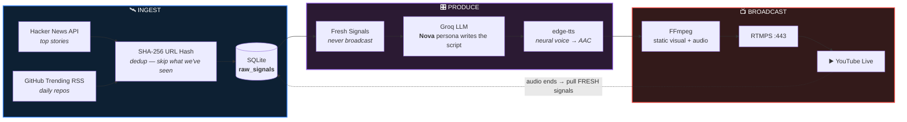
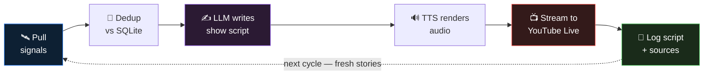
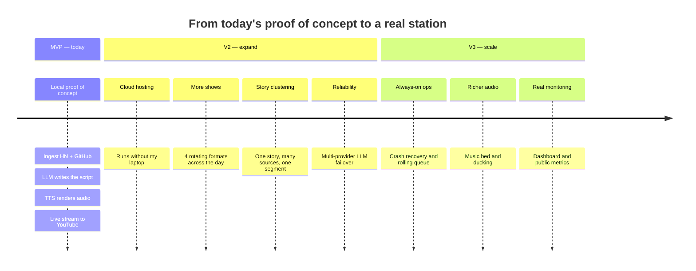

# 🎙️ AI-Powered 24/7 Radio

> **An autonomous AI radio DJ that scrapes the open internet, writes its own commentary, and streams to YouTube Live — continuously, with zero humans in the loop.**

<p>
  
  
  
  
  
</p>

> 🔴 **LIVE DEMO STREAM**: Watch the station broadcasting live on YouTube at **[AI-Powered 24-by-7 Radio](https://www.youtube.com/@AI-powered24-by-7radio)**!

---

## 🎥 Project Explanation

<video src="assets/demo_video.mp4" controls width="100%"></video>


https://github.com/user-attachments/assets/825ed2d6-c8db-46c4-a9e3-b432401e8e05


> 🎬 *Full 7.8-minute walkthrough video explaining the 24/7 AI Radio architecture, live ingestion, LLM script generation, TTS audio synthesis, and real-time RTMP streaming.*
## Live Streaming in YouTube 

Click Here :- **[AI-Powered 24-by-7 Radio](https://www.youtube.com/watch?v=dgMCfWt49eo)** <br> <br>
---

## ⚡ Quickstart — Run the Station

1. **Clone & Setup Environment**:
   ```bash
   git clone https://github.com/Narendrareddygithub/ai-powered-24-by-7-radio.git
   cd ai-powered-24-by-7-radio
   python -m venv .venv
   .venv\Scripts\activate
   pip install -r requirements.txt
   ```

2. **Configure Credentials**:
   ```bash
   cp .env.example .env
   # Edit .env with your GROQ_API_KEY and STREAM_KEY (Twitch / YouTube)
   ```

3. **Launch Autonomous 24/7 Station**:
   ```bash
   python main.py
   ```

## 💡 The Big Idea

| | |
|---|---|
| 🛰️ **It listens** | Continuously ingests breaking signals from Hacker News and GitHub Trending. |
| 🧠 **It thinks** | An LLM writes original editorial commentary — never reads articles verbatim. |
| 📺 **It speaks** | Neural TTS voices it as a radio host, and FFmpeg broadcasts it live to YouTube. |

> [!IMPORTANT]
> **There is no human in the loop.** No playlists. No pre-recorded shows. Every segment that goes on air is synthesized minutes before broadcast, from signals that were published hours earlier.

---

## 🏗️ How It Works — End to End



---

## 🔁 The Signal-to-Air Cycle

Each loop is finite — the stream ends when the audio ends, then the whole cycle starts over with brand-new content.



---

## 🧰 Tech Stack

| Layer | Tool | Why this one |
|:------|:-----|:-------------|
| 🛰️ **Ingestion** | `httpx` + `feedparser` | Pulls HN's JSON API and GitHub's RSS directly — no keys, no headless browser |
| 🧹 **Dedup** | SHA-256 URL hashing | Identical story from two outlets = one broadcast |
| 🗄️ **State** | SQLite (stdlib) | Zero setup, single file, survives restarts |
| 🧠 **Script** | Groq — `llama-3.3-70b-versatile` | Free tier, no credit card, OpenAI-compatible |
| 🔊 **Voice** | edge-tts | Keyless neural TTS, no character caps |
| 🎬 **Mux** | FFmpeg | Loop a still image, mux the AAC, push RTMPS |
| 📺 **Delivery** | YouTube Live (RTMPS :443) | Free global CDN — the station *is* the channel |

---

## ✅ Build Status

> Built in public at a hackathon. This table is the honest current state.

| Component | Status |
|:----------|:-------|
| 📄 Architecture & scope defined | ✅ Done |
| 🎨 Visual README + public repo | ✅ Done |
| 🛰️ Signal ingestion (HN + GitHub) | ✅ Done |
| 🧹 SHA-256 deduplication | ✅ Done |
| 🧠 LLM script generation (Groq) | ✅ Done |
| 🔊 TTS + AAC rendering | ✅ Done |
| 📺 Live broadcast (Twitch / YouTube RTMP) | ✅ Done |
| 🔁 Autonomous 24/7 loop | ✅ Done |

---

## 🗺️ Roadmap



---

## 🤝 Built in Public

Every step of this build lands in this repo — commits, docs, dead ends included.

⭐ **Star the repo** if you want to watch an AI learn to run a radio station.
