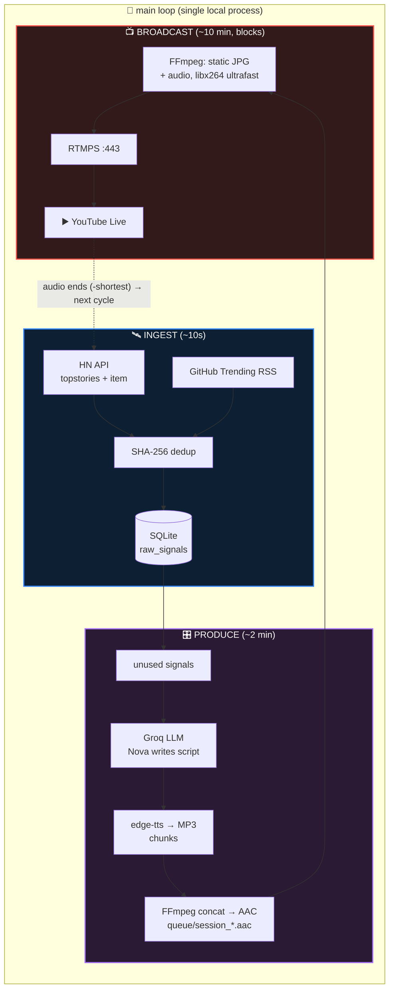

# specs.md — 24/7 AI Radio Station — MVP Specification (Hackathon Edition)

> **Mission:** a local Python app that runs an autonomous radio station on your laptop — it ingests fresh signals from the open internet, an LLM writes original radio commentary, TTS renders it as audio, and FFmpeg streams it to YouTube Live in a continuous loop. Zero humans in the loop.
>
> **This spec governs today's hackathon build (4–5 hrs).** The long-term vision lives in `Raw_Idea.md`; deferred features are listed in §14.

---

## 1. Constraints & Ground Rules

| Rule | Detail |
|------|--------|
| ⏱ **Time box** | ~4–5 hours total. Every component must be buildable & verifiable within the phase budget |
| 💻 **Runs on the local laptop** | Windows 11, Python 3.13. No cloud hosts, no Docker, no accounts beyond Groq + YouTube |
| 💸 **$0 external cost** | Groq free tier (no card), edge-tts (keyless), YouTube Live (free CDN) |
| 🕐 **Continuity over completeness** | A live YouTube stream with fresh AI content every cycle beats any single fancy feature |
| 🧱 **Phase-gated build** | Each execution phase has a verification gate — we do not start the next phase until the gate passes |
| 🔓 **Legal posture** | Ingest only public feeds/APIs; the LLM *synthesizes* commentary, never reads articles verbatim |

---

## 2. Scope

### 2.1 In scope (the MVP deliverable)

1. **Ingestion** of top Hacker News stories + GitHub Trending repos (public JSON API + RSS)
2. **Deduplication** by SHA-256 URL hash against local SQLite
3. **Script generation** — a single Groq call writes a ~1,500-word radio show ("Nova" persona)
4. **Audio synthesis** — edge-tts (chunked) → concatenated MP3 → AAC (128k, 44.1 kHz)
5. **Broadcast** — FFmpeg muxes a static visual + audio and pushes RTMPS to YouTube Live
6. **Autonomous loop** — when a show's audio ends, the next cycle produces brand-new content
7. **Audit log** — every aired script + cited sources stored in SQLite
8. **Smoke test** — end-to-end local verification *without* streaming

### 2.2 Out of scope (deferred → §14)

Cloud hosting (HF Spaces / Oracle / Render), Docker, Supabase, FastAPI health server, keep-alive cron, APScheduler, multi-provider LLM failover, semantic TF-IDF clustering, story clusters table, Kokoro-82M TTS fallback, background music ducking, the other 3 show formats, pre-rendered looping video (zero-transcode), crash recovery bootstrap, HF dataset asset vault, multi-segment rolling LLM calls, pytest suite.

---

## 3. System Architecture



**Timing model:** the stream itself is the timer. A show airs for ~10 minutes (audio duration); when FFmpeg exits via `-shortest`, the loop immediately ingests and produces the next show. ~1–2 min production gap between shows is acceptable — YouTube holds the broadcast and FFmpeg rejoins with the same stream key.

---

## 4. Project Layout

```
AI-Powered 247 Radio/
├── main.py              # entrypoint: init db → run radio loop forever
├── radio.py             # orchestrator: ingest() / produce_show() / stream loop
├── config.py            # env loading (python-dotenv), constants, path resolution
├── db.py                # SQLite: init, dedup check, insert, fetch unused, mark used, audit
├── schema.sql           # SQLite DDL (§6)
├── ingestion.py         # fetch_hackernews_top() + fetch_github_trending()
├── script_gen.py        # generate_show_script(signals) → (script, cited_urls)
├── audio_synth.py       # synthesize_audio(script) → (aac_path, duration)
├── streamer.py          # YouTubeStreamer: FFmpeg RTMPS, Windows-safe process mgmt
├── smoke_test.py        # phase-by-phase verification runner (no streaming)
├── tools/
│   ├── ffmpeg/bin/      # portable static ffmpeg.exe + ffprobe.exe (gitignored)
│   └── make_visual.py   # one-time generator for assets/static_visual.jpg
├── assets/
│   └── static_visual.jpg
├── queue/               # generated session audio + scripts (gitignored)
├── requirements.txt
├── .env                 # secrets (gitignored)
└── .env.example
```

---

## 5. Runtime Environment

| Requirement | Status / plan |
|-------------|---------------|
| Python 3.13 | ✅ present (`python 3.13.15`) |
| FFmpeg + FFprobe | ❌ absent, no winget/choco → **portable static build** downloaded into `tools/ffmpeg/bin/`, resolved by `config.py` via `shutil.which()` fallback — no admin, no PATH edit |
| Groq API key | user-provided → `.env` |
| YouTube stream key | user-provided → `.env` |
| venv | `python -m venv .venv` in project root (gitignored) |

**Windows portability rules (apply to every file):** relative paths via `pathlib.Path(__file__).parent`; env from `python-dotenv` (never `export`); `process.terminate()` (never `signal.SIGTERM`); no `/tmp`; subprocess calls list argv (no shell strings).

---

## 6. Data Model (SQLite — `radio.db`)

```sql
CREATE TABLE raw_signals (
    id            TEXT PRIMARY KEY,             -- uuid4().hex
    url_hash      TEXT NOT NULL UNIQUE,          -- sha256(canonical source_url)
    source_url    TEXT NOT NULL,
    source_name   TEXT NOT NULL,                -- 'hackernews' | 'github_trending'
    title         TEXT NOT NULL,
    summary_text  TEXT,                          -- HN score/comments or repo blurb
    ingested_at   TEXT DEFAULT (datetime('now')),
    is_used       INTEGER DEFAULT 0              -- 1 once included in an aired script
);
CREATE INDEX idx_raw_signals_unused ON raw_signals(is_used) WHERE is_used = 0;

CREATE TABLE broadcast_audit_log (
    session_id               TEXT PRIMARY KEY,   -- uuid4().hex
    actual_aired_at          TEXT,               -- set when stream starts
    full_script_transcript   TEXT NOT NULL,      -- exact words synthesized
    cited_source_urls        TEXT NOT NULL,      -- JSON array of source URLs
    llm_model                TEXT NOT NULL,
    tts_engine               TEXT DEFAULT 'edge-tts',
    audio_duration_seconds   REAL,
    created_at               TEXT DEFAULT (datetime('now'))
);
```

---

## 7. Component Specifications

### 7.1 `config.py`
Loads `.env` (python-dotenv). Constants:

| Constant | Value |
|----------|-------|
| `GROQ_MODEL` | `llama-3.3-70b-versatile` (fallback: any current model from Groq console) |
| `MAX_SIGNALS` / `MIN_SIGNALS` | 15 / 3 (cycle skips below minimum) |
| `TARGET_WORDS` | ~1,500 (~10 min of speech) |
| `TTS_VOICE` / `TTS_RATE` | `en-US-AndrewMultilingualNeural` / `+5%` |
| `TTS_CHUNK_CHARS` | 8,000 (edge-tts WebSocket drops on long text) |
| `AUDIO_FORMAT` | AAC 128 kbps, 44.1 kHz, stereo |
| `VIDEO` | 1280×720, 30 fps, H.264, 500k, GOP 60 |
| `RTMPS_URL` | `rtmps://a.rtmp.youtube.com:443/live2` |
| `FFMPEG` / `FFPROBE` | `shutil.which()` → fallback `tools/ffmpeg/bin/` |

### 7.2 `ingestion.py`
- `fetch_hackernews_top()` — GET `https://hacker-news.firebaseio.com/v0/topstories.json` → top 20 ids → GET `/v0/item/{id}.json` each; keep stories with a URL; `summary = "HN score: X, comments: Y"`. httpx, 15s timeout, try/except per source (one dead feed never kills the cycle).
- `fetch_github_trending()` — parse `https://mshibanami.github.io/GitHubTrendingRSS/daily/all.xml` via feedparser; top 20 entries; summary = entry summary truncated to 500 chars.
- Signal dict shape: `{source_url, source_name, title, summary}`.

### 7.3 `db.py`
`init_db()` (executes schema.sql), `signal_exists(url)`, `insert_signal(sig)`, `get_unused_signals(limit=MAX_SIGNALS)` (newest first), `mark_signals_used(ids)`, `log_broadcast(record)`. Single connection per call with `sqlite3.connect(DB_PATH)`; `check_same_thread=False` if a lookahead thread is added later.

### 7.4 `script_gen.py`
**One Groq call per show** (OpenAI-compatible client, `base_url=https://api.groq.com/openai/v1`):
- **System prompt:** Nova persona — high-energy, witty AI radio host covering open source & tech; conversational contractions, rhetorical questions; "never say you're an AI"; write ONLY spoken words — no stage directions, no [MUSIC] cues, no timestamps.
- **User prompt:** the formatted signal list (title, source, blurb, URL) + instruction: ~1,500 words, structured as (a) punchy cold open, (b) deep dive top 2–3 stories with developer impact, (c) community buzz + one under-the-radar pick, (d) rapid recap + bold prediction + "coming up next hour" teaser.
- `max_tokens=4000`, `temperature=0.8`. Returns `(script, cited_urls)`.
- **Failure mode:** on exception → log, return `None` → cycle skipped (loop sleeps and retries); never stream silence.

### 7.5 `audio_synth.py`
1. Chunk script at paragraph boundaries ≤ 8,000 chars
2. edge-tts each chunk → MP3
3. FFmpeg concat demuxer (`-c copy`) → single MP3
4. Convert → AAC 128k/44.1k/stereo → `queue/session_<YYYYMMDD_HHMMSS>.aac`
5. `ffprobe` → duration; also save the script text alongside as `queue/session_<ts>.txt`
Cleanup temp chunk files; return `(aac_path, duration)`.

### 7.6 `streamer.py`
```bash
ffmpeg -y -re -loop 1 -i assets/static_visual.jpg -i <audio.aac> \
  -c:v libx264 -preset ultrafast -tune stillimage -b:v 500k -maxrate 500k \
  -bufsize 1000k -pix_fmt yuv420p -g 60 -keyint_min 60 -sc_threshold 0 -r 30 \
  -c:a aac -b:a 128k -ar 44100 -ac 2 \
  -f flv -flvflags no_duration_filesize -shortest \
  rtmps://a.rtmp.youtube.com:443/live2/<STREAM_KEY>
```
`subprocess.Popen` (list argv), block until exit; missing key → hard error before start; `terminate()` for graceful stop. *(The `-reconnect*` flags from the old plan are input-side HTTP options — invalid for RTMPS output — removed.)*

### 7.7 `radio.py` + `main.py`
```python
def main():
    init_db()
    while True:
        ingest()                      # refresh signals (~10s)
        show = produce_show()        # signals → Groq → edge-tts → queue/session_*.aac
        if show:
            stream_to_youtube(show)  # blocks ~audio duration, then FFmpeg exits
        else:
            time.sleep(120)          # starved or LLM failure → retry next cycle
```
`produce_show()` also writes the audit row and marks signals used.

### 7.8 `smoke_test.py`
Subcommands: `db` (create/insert/read), `ingest` (live feeds → rows), `script` (Groq → print word count), `audio` (script → AAC → print duration), `full` (ingest→script→audio, **no streaming**). Used as each phase's verification gate.

### 7.9 `assets/static_visual.jpg`
Generated once by `tools/make_visual.py` with Pillow: 1280×720 dark station-branded card ("🎙️ OPEN SOURCE PULSE — AI RADIO, live indicator"). Pillow is added to requirements solely for this.

---

## 8. External Interfaces

| Interface | Auth | Limits relevant to MVP |
|-----------|------|------------------------|
| HN Firebase API | none | Unauthenticated; top-20 read is trivial load |
| GitHub Trending RSS | none | Public unofficial mirror feed |
| Groq | `GROQ_API_KEY` | Free tier ample: ~1 call/cycle ≈ 4–5K tokens in / 1.5–4K out; ~150 cycles/day ≈ well under daily caps |
| edge-tts | none (keyless) | Chunking handles long-text WebSocket drops |
| YouTube Live | stream key | Persistent "default" stream key reused across shows; short gaps tolerated |

---

## 9. Error Handling & Degraded Modes

| Failure | Behavior |
|---------|----------|
| One feed down | Other feed still supplies signals (per-source try/except) |
| < 3 unused signals | Skip cycle, sleep 120s, re-ingest (logged warning) |
| Groq call fails | Skip cycle (log); retry next loop |
| edge-tts chunk fails | Retry chunk once, else skip cycle |
| FFmpeg exit ≠ 0 | Log stderr tail, continue loop (next show re-attempts) |
| Missing stream key | Hard error at startup — never silently idle |

**Principle:** the loop never dies; the worst case is a paused broadcast with a logged reason.

---

## 10. Configuration — `.env.example`

```bash
GROQ_API_KEY=your_groq_api_key
YOUTUBE_STREAM_KEY=your_youtube_stream_key
```

`.env` is gitignored — never committed. Optional overrides (config defaults shown): `SHOW_MINUTES` (not enforced; audio length defines it), `GROQ_MODEL`, `TTS_VOICE`.

---

## 11. Dependencies — `requirements.txt`

```
httpx
feedparser
edge-tts
openai
python-dotenv
pillow
```

*(fastapi, uvicorn, supabase, apscheduler from the old plan are dropped.)*

---

## 12. Risks & Mitigations

| Risk | Likelihood | Mitigation |
|------|-----------|------------|
| 🔴 YouTube live not enabled on channel (activation can take 24h) | medium | **User checks/enables immediately** — flagged as Phase 0 gate |
| Groq model name 404s | low | `GROQ_MODEL` is one line in `.env`; swap to any current console model |
| edge-tts throttling | low | chunked requests; retry once; (Kokoro fallback = V2) |
| Show gap causes YouTube to end broadcast | low | YouTube holds broadcast ~5 min without input; production gap is 1–2 min. Stretch: prefetch next show in a thread (Phase 6b) |
| Windows path/arg quirks in FFmpeg | low | list argv + relative pathlib paths, tested in Phase 5 |

---

## 13. Definition of Done (demo)

1. `python main.py` runs unattended for **≥ 2 full cycles** (~25 min) without human input
2. YouTube Live shows the branded visual + audible Nova voice, **both cycles have different, fresh scripts**
3. `broadcast_audit_log` contains a row per aired show with transcript + cited URLs
4. Code + docs pushed to the public repo; README build-status table updated

---

## 14. V2 Backlog (explicitly deferred)

Cloud hosting decision (Oracle always-free ARM vs HF PRO $9/mo), Supabase migration + story_clusters, Docker packaging, multi-provider LLM failover (Gemini, OpenRouter), TF-IDF semantic clustering, rolling 2-session lookahead queue, 3 more show formats (AI & Startup Capital, ArXiv Lab Notes, Big Ideas), Kokoro-82M offline TTS, background music ducking, pre-rendered looping video (zero-transcode), crash recovery bootstrap, HF dataset asset vault, real test suite.
